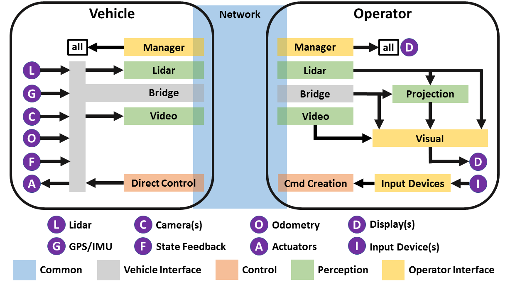

# TUM FTM Teleoperated Driving Software

This is the container repository of the TUM FTM Teleoperated Driving Software Stack. The stack is ROS-based and tested on Ubuntu 18.04 with ROS Melodic, only.

Within this repository, the ROS packages are grouped thematically in the following submodules:
- wsp/src/tod_common
- wsp/src/tod_vehicle_interface
- wsp/src/tod_perception
- wsp/src/tod_operator_interface
- wsp/src/tod_control


## System Architecture

The system architecture is depicted in the following graphic. The color of the packages corresponds to the grouping of the packages in the respective submodules.



## Getting Started

Follow these commands to clone, build and run the TUM FTM Teleoperated Driving Software Stack.

  * Clone this repository. 
  * Initialize all submodules.
    ```
    git submodule update --recursive --init
    ```
  * Install the dependencies of each respective package. A list of dependencies with install commands is found in each package's README.
  * Create the config of your vehicle with the corresponding `vehicleID`, following the instructions and samples in the `tod_vehicle_interface/tod_vehicle_config` package.
  * Build and source the workspace.
    ```
    cd wsp
    catkin build
    source devel/setup.bash # or `setup.zsh`, depending on your shell
    ```

*Note (February 2021):* Currently, only the `tod_perception/tod_video` package with dependencies is available. To get started with this, follow the instructions in the README of this package. More components of the software stack will be published in the coming weeks. 
