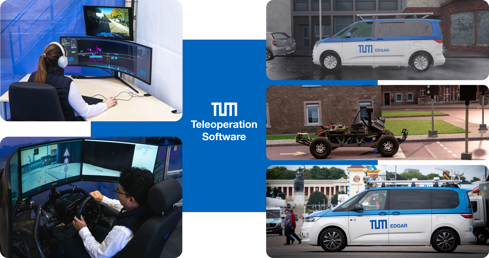

# TUM FTM Teleoperated Driving

本项目是 [TUMFTM/teleoperated_driving](https://github.com/TUMFTM/teleoperated_driving)
的 Fork，基于 Ubuntu 22.04、ROS 2 Humble 和 Docker，用于操作端与车端的远程驾驶实验。



## 本 Fork 的修改

- 支持 Logitech G923，并在操作端启动前自动设置 80% 回正力。
- 支持 Peanut01 的控制、车辆状态、三路相机视频和主雷达点云。
- 网卡、ROS Domain ID、车辆 ID 和传感器 Domain ID 均可配置。
- 操作端和车端运行内容已构建进正式镜像，不依赖源码 overlay。

## GHCR 镜像

项目发布两个镜像，每个镜像同时支持 `linux/amd64` 和 `linux/arm64`：

```text
ghcr.io/sl-kai/teleoperated-driving-operator
ghcr.io/sl-kai/teleoperated-driving-vehicle
```

克隆并拉取 `edge` 镜像：

```bash
git clone -b ros2 https://github.com/sl-kai/teleoperated_driving.git
cd teleoperated_driving
docker compose pull tod_operator tod_vehicle
```

## 配置

查看 IP 和网卡名称：

```bash
ip -br -4 addr
```

按实际机器修改 `.env`，两端必须使用相同的 `DOCKER_ROS_DOMAIN_ID`：

```dotenv
DOCKER_ROS_DOMAIN_ID=7
VEHICLE_ID=edgar
VEHICLE_NETWORK_INTERFACE=eth1
OPERATOR_NETWORK_INTERFACE=eno1
```

Peanut01 的视频、雷达和车辆接口配置位于
`config/config/vehicle_config/peanut01/`。真实车辆测试前必须确认急停、安全驾驶员、
控制限幅、挡位逻辑和车轮架空条件。

## 启动与停止

车端：

```bash
docker compose up -d tod_vehicle
docker compose ps
docker compose logs --tail 100 tod_vehicle
docker compose stop tod_vehicle
```

操作端：

```bash
xhost +local:docker
docker compose up -d tod_operator
docker compose ps
docker compose logs --tail 100 tod_operator
docker compose stop tod_operator
```

在操作端 Manager 中填写车端 IP，选择本机操作端 IP、控制模式和输入配置，
然后依次点击 `Connect` 和 `Start`。没有方向盘时选择 `virtual.yaml`，
使用 G923 时选择 `logitechg923.yaml`。

## 常用检查

```bash
# 查看 ROS 2 节点和话题
docker compose exec tod_operator bash -lc "source /entrypoint.sh && ros2 node list"
docker compose exec tod_operator bash -lc "source /entrypoint.sh && ros2 topic list"

# 查看话题类型、发布者和订阅者
docker compose exec tod_operator bash -lc "source /entrypoint.sh && ros2 topic info -v <TOPIC>"

# 查看数据
docker compose exec tod_operator bash -lc "source /entrypoint.sh && ros2 topic echo <TOPIC>"
```

## 构建与发布

需要从源码本地构建时：

```bash
./setup_repos.sh
docker compose build tod_vehicle tod_operator
```

推送 `ros2` 分支会发布 `edge`。推送 `v1.0.0` 格式的 Git 标签会发布
`1.0.0` 和 `latest`：

```bash
git tag v1.0.0
git push origin v1.0.0
```

## 上游与许可证

本 Fork 保留上游版权和 [GNU LGPL v3](LICENSE) 许可证。

论文：T. Kerbl et al., *TUM Teleoperation: Open Source Software for Remote Driving
and Assistance of Automated Vehicles*, 2025,
[doi:10.48550/arXiv.2506.13933](https://doi.org/10.48550/arXiv.2506.13933)。
