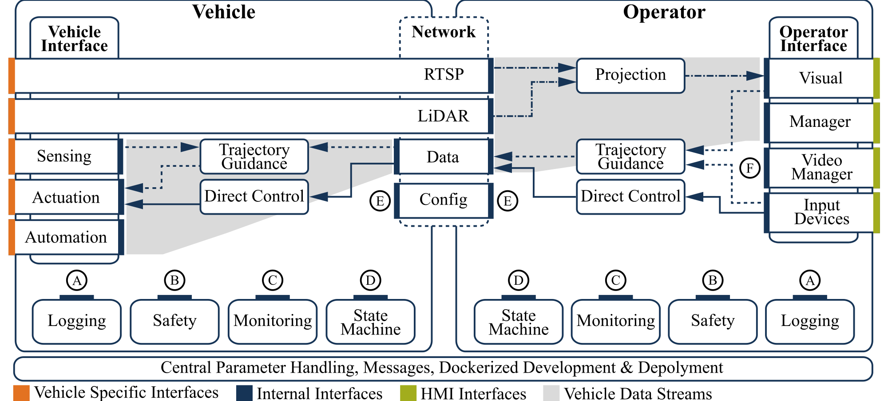

# TUM FTM Teleoperated Driving Software

[[_TOC_]]

This is the container repository of the TUM FTM Teleoperated Driving Software Stack. The stack is ROS2-based and tested on Ubuntu 22.04 with ROS Humble, only.

The ROS packages are grouped thematically in the following sub-repositories:

- tod_common
- tod_direct_control
- tod_launch
- tod_logging
- tod_monitoring
- tod_msgs
- tod_network
- tod_operator_interface
- tod_perception
- tod_safety
- tod_state_machine
- tod_trajectory_guidance
- tod_vehicle_interface

A video, showcasing the software on three different vehicle systems will be available soon.

## System Architecture

The system architecture is depicted in the following graphic. The color of the packages corresponds to the grouping of the packages in the respective sub-repositories. A more detailed overview of the architecture can be found on the wiki page.

## Getting Started

[Getting Started](doc/getting_started.md)

### Docker Workflow

Detailed information about the docker workflow used for development and deployment can be found under [Docker Workflow](doc/docker_workflow.md).

## Publication

This work was submitted to IV 2025
