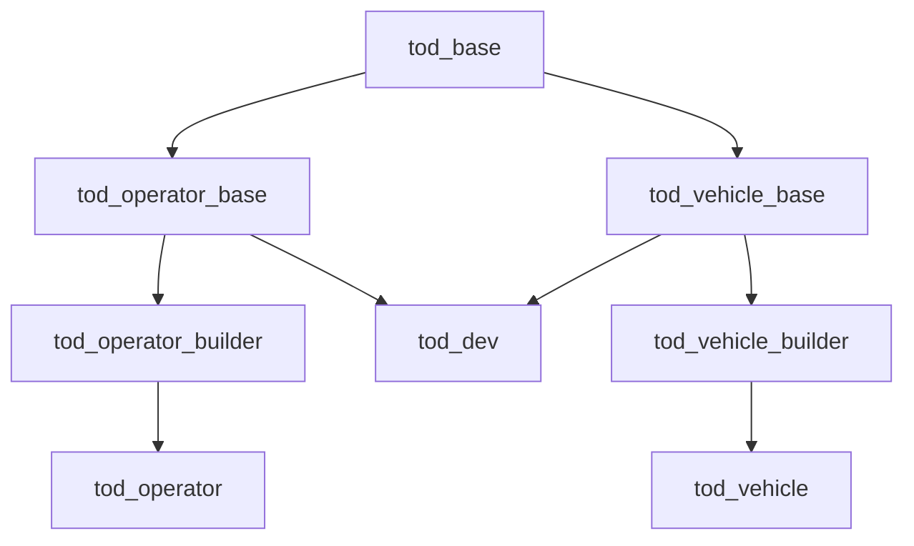

# Docker Workflow
The following tutorial descibes the docker workflow to deploy and develop the TUM FTM Teleoperated Driving Software.

## Prerequisites

### vcstool

vcstool (https://github.com/dirk-thomas/vcstool) is used to manage all repositories of the TUM FTM Teleoperated Driving Software and the required external repositories.

- Install via pip
  ```bash
  sudo pip install vcstool
  ```
- Optional: Add following line for auto-completion to .bashrc / .zshrc
  ```bash
  source /usr/share/vcstool-completion/vcs.bash # bash
  source /usr/share/vcstool-completion/vcs.zsh # zsh
  ```

### docker compose

Docker compose (https://docs.docker.com/compose/) is used to orchestrate the docker workflow. **Note** that Compose V2 (docker compose) is required and not Compose V1 (docker-compose). Detailed Information for installation using the docker repositories can be found under https://docs.docker.com/compose/install/linux/#install-using-the-repository.

### NVIDIA GPU Support

To make use of GPU acceleration NVIDIA drivers must be properly setup on the host and the [NVDIA Container Toolkit](https://github.com/NVIDIA/nvidia-container-toolkit) must be installed.
- Check NVIDIA-Divers by calling nvidia-smi
  ```bash
   nvida-smi 
   ```
- Install NVIDIA Container Toolkit according to https://docs.nvidia.com/datacenter/cloud-native/container-toolkit/latest/install-guide.html

### Network Interface Configuration
Make sure you have applied the following multicast settings to your machine's loopback interface: https://collab.dvb.bayern/display/TUMftm/ROS+2+Setup (section "ROS2 mit Docker"). Necessary to use the ``DOCKER_CYCLONEDDS_CONFIG=no_multicast`` in the ``.env`` file.

## Docker Structure
All docker images are defined in ``/docker/dockerfile``. Services to build the images and run the containers are specified in the ``docker-compose.yaml`` and ``.env`` files. The available docker images are built in different stages and consecutively rely on each other:



The following table gives an overview how the stages, images aand services are connected to each other. In the development and deployment stage addidtional GPU services are available to run the containers with NVIDIA GPU support.

| Stage | Images | Services | Description | 
|--     |--      |--        | --          |
| Base | tod_base | tod_base | Contain  the ROS installation, basic tools and general dependencies. |
| Base-Extension | tod_operator_base, tod_vehicle_base |tod_operator_base, tod_vehicle_base | Adds additional operator / vehicle specific dependencies and required ROS packages are installed via rosdep. |
| Development | tod_dev | tod_dev, tod_dev_gpu| Contains all dependencies (currently only based on tod_operator_base since there are no vehicle specifc dependencies yet) and additional development tools. 
| Builder | tod_operator_builder, tod_vehicle_builder |tod_operator_builder, tod_vehicle_builder | Only used as intermediate stage to build the TUM FTM Teleoperated Driving Software. Ensures that no build artifacts are included in the deployment images. |
| Depolyment | tod_operator, tod_vehicle |tod_operator, tod_operator_gpu tod_vehicle, tod_vehicle_gpu | Only contain the binaries built in the Builder stage. |

## Setup 
After cloning the tod repository (make sure the docker_compose branch is checked out) use the following steps to setup the docker workflow.

1. Setup repositories using *setup_repos.sh* script (optionally use the VSCode task: *setup_repos*)
   ```bash
   cd tod
   chmod +x setup_repos.sh && ./setup_repos.sh
   ```
2. Build specific image / all images (optionally use VSCode task: *build_dev*, *build_all*)
   ```bash
   cd tod
   docker compose build <image_name> # builds given image
   docker compose build # builds all images
   ```

## Manage repositories using vcstool
Required repositories and their versions are listed in the *dependencies.repos* file. The vcs tool is used to manage those repositories.

- Check status of all repositories in */src*
   ```bash
   vcs status src
   ```
- Pull all repositories in */src*
  ```bash
   vcs pull src
   ```
Pushing to the tod repositories should be handeled seperately inside each repository with own credentials via https.

## Development Workflow
For development the source code in the */src* is mounted into the *tod_dev* container. Build files are written to the *.dev_artifacts* directory. Thus, changes to the source code and binaries are synchronized between the host and the container, and no changes are lost when the container is stopped.

1. Start development container &rarr; runs until terminated by the user
   ```bash
   cd tod
   docker compose --env-file .env up tod_dev
   ```
2. Connect to container in second terminal
   ```bash
   docker exec -it tod_dev_latest bash
   ```

*tod_dev* is also configured as a devcontainer for VSCode. When the *tod* reporotory is opened in VSCode, it can be opened directly in the *tod_dev* container (more information: https://code.visualstudio.com/docs/devcontainers/containers).

## Deployment
Run arguments (e.g. vehicleID) for *tod_vehicle* and *tod_operator* are specified in the *docker-compose.yaml* and *.env* files. 
- Start *tod_vehicle*
  ```bash
   cd tod
   docker compose --env-file .env up tod_vehicle
   ```
- Start *tod_operator*
   ```bash
   cd tod
   docker compose --env-file .env up tod_operator
   ```

## Configuration via .env
All necessary configurations to the docker compose workflow should be made centrally in the ``.env`` file. To do so, variables are defined in the ``.env`` file which are accessed in ``docker-compose.yaml`` to set image build arguments, container environment variables, commands and any other variables.

   :warning: **By default ROS multicasting is enabled.** To avoid spamming all available network interfaces with ROS messages make sure to set  ``DOCKER_CYCLONEDDS_CONFIG=no_multicast`` in the ``.env`` file.
   Please refer to the following setup when in the FTM network: https://collab.dvb.bayern/display/TUMftm/ROS+2+Setup (section "ROS2 mit Docker")

**Workflow is based on:**
- https://roboticseabass.com/2023/07/09/updated-guide-docker-and-ros2/
- https://github.com/sea-bass/turtlebot3_behavior_demos
- https://github.com/athackst/vscode_ros2_workspace