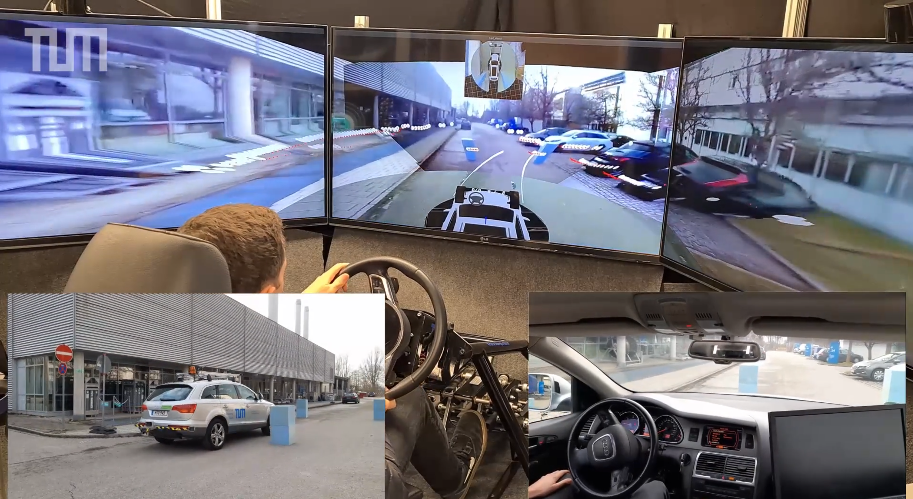

# tod_direct_control

This repository holds packages related to direct control of a teleoperated vehicle. 

Direct control refers to a teleoperation concept where a remote operator directly influences the vehicle dynamics via input of steering wheel and pedal input which are then sent over the network and replicated on the vehicle side. 
The general principle and functionality can be seen in the figure below and [this link](https://www.youtube.com/watch?v=bQZLCOpOAQc).

This repository holds all nodes that enable the following tasks:
- Subscribing on sensor_msgs joystick messages of type [sensor_msgs/msg/Joy](https://docs.ros2.org/foxy/api/sensor_msgs/msg/Joy.html) given by the `tod_command_creation` package and converting them to desired steering angle and velocity commands of type [tod_direct_control_msgs/msg/PrimaryControlCmd](TODO)
(this task is task is handled in the package [`tod_command_creation`](./tod_command_creation) )
- Forwarding the steering wheel and velocity command to the vehicle's interface if the operation mode direct control is selected 
(this task is task is handled in the package [`tod_command_forwarder`](./tod_command_forwarder) )

Futhermore, this repository holds message definitions (see package [`tod_direct_control_msgs`](./tod_direct_control_msgs) ) as well as launch files (see package [`tod_direct_control_launch`](./tod_direct_control_launch) ) that make this repository self-contained with respect to the tasks above and enable direct control.  

Another way to interact with the vehicle is **trajectory guidance** where the operator specifies a set of waypoints and a velocity profile the vehicle shall follow. The respective repository can be found in [a seperate repository](TODO).

## Build

To build all packages and their dependencies:

    colcon build --packages-up-to tod_direct_control_launch

## Launch the Operator and Vehicle Side

To start the node on the operator side:

    ros2 launch tod_command_creation tod_command_creation.launch.py

To start the node on the vehicle side: 

    ros2 launch tod_command_forwarder tod_command_forwarder.launch.py

To use a custom vehicleID, append `vehicleID:=<yourVehicleID>` to the launch call.

Other parameters related to command creation (maximum velocity and acceleration, maximum steering wheel angle, ...) can be set in the [launch file for the respective node](./tod_command_creation/launch/tod_command_creation_operator_launch.py). 