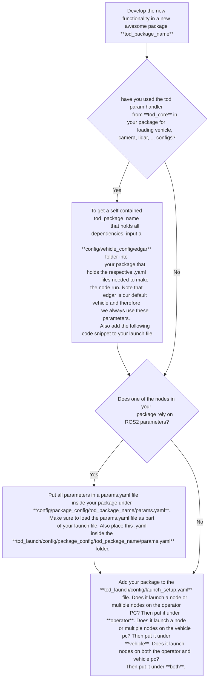

# tod_launch

This repository includes the package `tod_launch` which allows for convenient launching of the tod software stack with only one call to the command line. 
The provided launch files recursively call the respective launch files of packages inside the tod software stack. 

Most importantly, this package allows for simple configuration of the most important parametes as well as the packages to launch via the [launch_setup.yaml](./tod_launch/config/launch_setup.yaml) file.
That means you can **configure the whole tod software stack without the need to write .py launch files**. 

## Working with tod_launch

### 1. Starting the tod software stack with default settings

Since teleoperation takes place on different systems (one operator work station and one vehicle at most), we need to launch different parts of the software on different PCs. tod_launch takes care of that via different launch files.

After building the package using `colcon build --packages-up-to tod_launch && source install/setup.bash`, you can start the software **on the operator PC** via

    ros2 launch tod_launch tod_operator.launch.py

To start the software **on the vehicle PC**, use  

    ros2 launch tod_launch tod_vehicle.launch.py

When **developing new functions on a local PC**, it may be beneficial to start the whole software stack. 
This can be done via   

    ros2 launch tod_launch tod_both.launch.py

You can specify two launch arguments over the CLI when calling the launch-command:
- `vehicleID:=<your_vehicle_id>` allows to specify the vehicle you are using. All applicable vehicle IDs can be foud in the [config/vehicle_config](./tod_launch/config/vehicle_config) folder. If you want to add a new vehicle, respective parameter files and a vehicle bridge have to be added
- `mode:=<mode>` allows to choose between `vehicle` which is the default mode and allows to connects to a real vehicle and `onlySim` which simulates the dynamics of a vehicle and allows for local development.  

### 2. Configuring parameters and packages to launch

The `tod_launch` package allows to convieniently configure the tod software stack using a `.yaml` file without the need to write Python based launch files.
The process of generating the launch structure that loads the packages in the background is fully automated and abstracted from the user.

To configure the launch setup, the [launch_setup.yaml](./tod_launch/config/launch_setup.yaml) file has to be modified to the preferences of the user. 
The following shows an excerpt of the `.yaml` to demonstrate working with it.
It consists if two layers:
- `launch_parameters` allows to set the two parameters described above
- `packages_to_launch` allows to configure which packages shall be launched on the operator and vehicle side respectively. Some packages launch nodes on both operator and vehicle PC. Those can be found in the field both. Enabling and disabling the launch of respective packages and their nodes can be adjusted by setting the flags to `True` or `False`  

```yaml
launch_parameters:
  vehicleID: 'edgar'        # Choice of any vehicle identifier in config/vehicle_config
  mode:      'vehicle'      # Choice of {vehicle, only_sim}

packages_to_launch:
  operator:                 # Packages that launch nodes on the operator side
    tod_input_devices:        True  
    tod_command_creation:     False      
  vehicle:                  # Packages that launch nodes on the vehicle side
    tod_command_forwarder:    True   
  both:                     # Packages that launch nodes on both sides
    tod_trajectory_guidance:  False
```

### 3. Adding new packages to the launch routine

The `tod_launch` package allows for simple integration of new packages into the launch structure.
Since we aim to develop self-contained packages, the following process shall be adhered to in order to allow for seamless integration into the tod software stack  

We present an example use case of adding a new parameter `compression_rate` to the launch file that shall be passed to the new package `tod_pointcloud_compression` which is developed as a new functionality by a scientist for efficient pointcloudstreaming.

Since pointcloudstreaming starts at the vehicle side, the scientist starts by adjusting the `tod_vehicle_launch.py` launch file:

Since the pointclouds shall be recieved and displayed on the operator side, the `tod_operator_launch.py` shall also be adapted. This is left as an exercise to the reader. 



