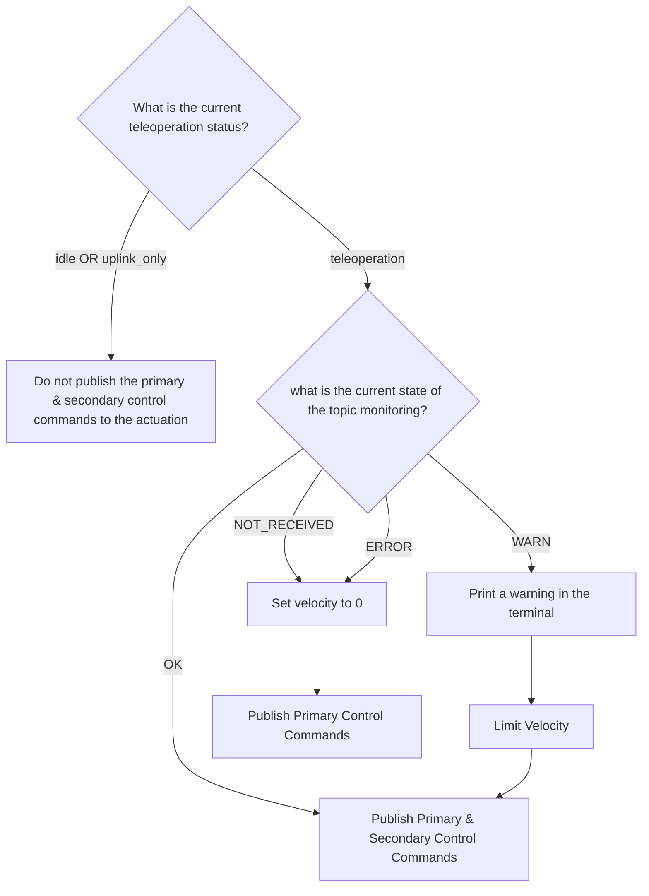

# tod_safety_gate (#tod_safety_gate)

## Overview

This package ensures that the control signals are only sent to the actuation if the Teleoperation is active and the status-message is received properly.



## Nodes

### safety_gate

This node subcribes to the the topic_monitoring status. If there are no timeouts in any of the checked topics, the control commands are passed. If there are warnings, the velocity is limited and if there is a timeout, the vehicle stops.

#### Subscribed Topic

| topic name | message type |
|---|---|
| input/primary_control_cmd | tod_vehicle_msgs/PrimaryControlCmd |
| input/secondary_control_cmd | tod_vehicle_msgs/SecondaryControlCmd |
| input/status | tod_status_msgs/Status |
| input/topic_monitoring_status | tod_topic_monitoring_msgs/TopicState |

#### Published Topics

| topic name | message type |
|---|---|
| output/primary_control_cmd | tod_vehicle_msgs/PrimaryControlCmd |
| output/secondary_control_cmd | tod_vehicle_msgs/SecondaryControlCmd |

#### Parameters

| parameter | type | default value | description |
|---|---|---|---|
| warning_velocity | double | 2.7778 | maximum velocity if a warning is received |

## Prerequisites / Dependencies

This Package was developed for Ros2 Humble.

## TOD Package dependencies

- tod_status_msgs
- tod_topic_monitoring_msgs
- tod_vehicle_msgs

## Build

```console
colcon build --packages-up-to tod_safety_gate
```

## Running the Package

```console
ros2 run tod_safety_gate safety_gate
```

## Launch Files

```console
ros2 launch tod_safety_gate tod_safety_gate.launch.py
```

## Configuration Files

find the configuration file in ```config/package_config/tod_safety_gate```


## Doxygen stuff
\version 1.0
\author Florian Pfab
\defgroup tod_safety_gate ToD Safety
\ingroup tod_safety
\brief rudimentary deceleration and stop if the status message is not received