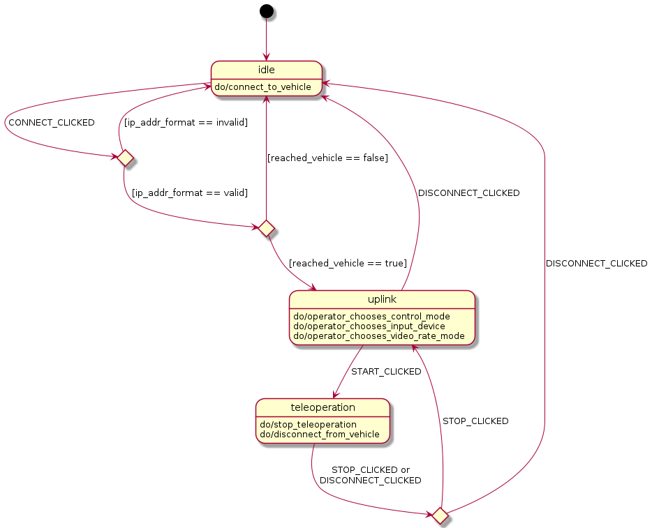

# tod_state_machine
 
## Overview
 
This package defines the statemachines for both the vehicle and operator side. The state machine is modeled
as a Boost-SML State Machine. 
 
## Nodes
 
Node `OperatorStateMachine`: Structure and logic of the operator statemachine

    Subscribed Topics: /operator/manager/button_status, /operator/statemachine/status_from_vehicle
    Published Topics: /operator/statemachine/operator_status
    Services: -
    Parameters: -

Logic:



Node `VehicleStateMachine`: Structure and logic of the vehicle statemachine

    Subscribed Topics: /operator/statemachine/operator_status, /vehicle/interface/actuation/from_automation/safety_driver_status
    Published Topics: /operator/statemachine/vehicle_status
    Services: -
    Parameters: -
 
## Prerequisites / Dependencies
 
This Package was developed for ROS2 Humble.
 
## ToD Package Dependencies

See package.xml
 
## Build the Package
 
```console
colcon build --packages-up-to tod_state_machine
```

## Running the Nodes in this Package
 
```console 
ros2 run tod_state_machine OperatorStateMachine VehicleStateMachine
```

## Launch files: Launch the State Manager on Operator and Vehicle Side respectively 
 
```console
ros2 launch tod_state_machine tod_state_machine_{operator,vehicle}.launch.py
```

## Configuration files

This package contains no configuration file
