# ToD Trajectory Guidance {#tod_trajectory_guidance_doc}
================


# Overview

The TOD TrajectoryGuidance Packages contains the logic to create and validate paths for the vehicle. The generated path is sent to the vehicle which calculates a velocity profile and generates a trajectory based on the path. Upon validation the trajectory is sent to TOD_PurePursuit for path following. The TrajectoryGuidance Statemachine manages the control flow for starting, stopping, aborting and so on. 

Several safety layers are build into the package such as a emergency trajectory on disconnect and stop on operator input. 


For a more theoretical evaluation of a very similar implementation of the concept see Majstorovic et al. 2024
"[Trajectory Guidance: Enhanced Remote Driving of highly-automated Vehicles](https://arxiv.org/abs/2402.10014)" created in ["Should Teleoperation Be like Driving in a Car? Comparison of Teleoperation HMIs"](https://arxiv.org/abs/2404.13697)


Related message type defintions can be found under tod_msgs/tod_trajectory_guidance_msgs


## Statemachine of Trajectory Guidance

```mermaid
%%{init: {
    'theme': 'base',
    'themeVariables': {
        'primaryColor': '#326ce5',
        'primaryBorderColor': '#1a56c4',
        'lineColor': '#666',
        'secondaryColor': '#e6f3ff',
        'tertiaryColor': '#fff',
        'statePadding': 5,
         'nodeSpacing': 10, 
    },
    {'relation': {'type': 'straight'}},

}}%%
stateDiagram-v2
    
    classDef waiting fill:#f4f4f4,stroke:#333,stroke-width:3px
    classDef executing fill:#e6f3ff,stroke:#326ce5,stroke-width:3px
    classDef validating fill:#f5f5f5,stroke:#666,stroke-width:3px
    classDef stopping fill:#fff0f0,stroke:#ff6b6b,stroke-width:3px
    
    [*] --> WaitingForTrajectory

    WaitingForTrajectory --> ValidatingTrajectory : TRAJECTORY_RECEIVED/calc_trajectory()    
    ValidatingTrajectory --> ValidatingTrajectory : VELOCITY_UPDATE_RECEIVED\n[velocity_valid]/calc_trajectory()
    ValidatingTrajectory --> WaitingForTrajectory : TRAJECTORY_REJECTED/reset_trajectory()
    ValidatingTrajectory --> ValidatingTrajectory : TRAJECTORY_RECEIVED/calc_trajectory()
    ValidatingTrajectory --> ValidatingTrajectory : VALIDATED_TRAJECTORY_RECEIVED/set_inactive_trajectory()
    ValidatingTrajectory --> ExecutingTrajectory : START_TRAJECTORY[can_start_trajectory]/start_trajectory()
    ValidatingTrajectory --> WaitingForTrajectory : RESET_TRIGGERED/reset_trajectory()
    
    ExecutingStopTrajectory --> WaitingForTrajectory : EXECUTION_FINISHED/reset_trajectory()
    ExecutingStopTrajectory --> WaitingForTrajectory : RESET_TRIGGERED/reset_trajectory()

    ExecutingTrajectory --> ExecutingTrajectory : VELOCITY_UPDATE_RECEIVED[velocity_valid]/update_velocity_active_trajectory()
    ExecutingTrajectory --> ExecutingStopTrajectory : EXECUTION_CANCELED/calc_stop_trajectory()
    ExecutingTrajectory --> ExecutingStopTrajectory : RESET_TRIGGERED/calc_stop_trajectory()
    ExecutingTrajectory --> ExecutingStopTrajectory : WATCHDOG_TRIGGERED/calc_stop_trajectory()
    ExecutingTrajectory --> WaitingForTrajectory : EXECUTION_FINISHED/reset_trajectory()

    class WaitingForTrajectory waiting
    class ValidatingTrajectory validating
    class ExecutingTrajectory executing
    class ExecutingStopTrajectory stopping
```





Content:
- **TOD TrajectoryGuidance** \ref tod_trajectory_guidance
  - **Vehicle**
    - statemachine_trajectory_guidance_vehicle.hpp
    - trajectory_guidance.cpp (inkl. StateMachine)
    - trajectory_guidance_node.cpp
  - **Operator**
    - path_creator.cpp
    - path_helper.cpp

## Executables
- **Vehicle**:
  - TrajectoryGuidanceNode
  - TrajectoryGuidance
- **Operator**:
  - OperatorPathCreator

## Subscribed Topics
- **PathCreator**:
  - `/input/mouse_position_click` - Mouse click position
  - `/input/mouse_position_moved` - Mouse movement position
  - `/input/mouse_position_released` - Mouse release position
  - `/input/key_press` - Keyboard input
  - `/input/odometry` - Vehicle odometry data
  - `/input/trajectory_guidance_state` - Trajectory guidance state updates
  - `/input/simulated_trajectory` - Simulated trajectory data
  - `/input/operator_status` - Operator status updates

- **TrajectoryGuidanceNode**
  - `input/path` - Path from operator, Node computes a velocity profile of the path and publishes a trajectory 
  - `input/status` - Vehicle status updates
  - `input/watchdog` - Watchdog monitoring status
  - `input/ptc_logging` - Logging data for control state
  - `input/trajectory_control_cmd` - Control Commands for starting stoping and controlling the velocity during trajectory guidance

## Published Topics
- **PathCreator**
  - `output/visualization_path` - Path visualization for @ref tod_visual
  - `output/path` - Path data sent to vehicle
  - `output/trajectory_control_cmd` - Trajectory control commands i.e. start stop and speed
  - `output/path_control_points` - Control points from mouse clicks
  - `output/simulated_trajectory_visualization` - Simulated trajectory visualization for validation in @ref tod_visual


- **TrajectoryGuidanceNode**
  - `output/active_trajectory` - Active/current trajectory being executed
  - `output/validation_trajectory_vehicle` - validation trajectory for the controller simulation @ref path_simulator  
  - `output/path_array_for_rviz` - Visualization data for RViz
  - `output/trajectory_guidance_state` - Current state of trajectory guidance system


## Parameters
- PathCreator
  - `min_velocity` (double, default: 3.0) - Minimum velocity threshold
  - `velocity_increment` (double, default: 1.0) - Velocity increment step
  - `y_max_curv` (double, default: 3.0) - Maximum Y curvature
  - `maxCurv` (double, default: 0.133) - Maximum curvature
  - `step_size` (double, default: 0.1) - Step size for calculations
  - `validation_marg` (double, default: 0.1) - Validation margin
- TrajectoryGuidanceNode
  - `control_mode` (int, default: 3) - Control mode setting

# Usage
Perform the Trajectory Guidance teleoperation concept within the teleoperation stack.


## Build
```bash
colcon build --packages-up-to tod_trajectory_guidance
```

## Launch

- Operator (PathCreator): 
```bash
ros2 launch tod_trajectory_guidance tod_trajectory_guidance_operator.launch.py
```

- Operator (TrajectoryGuidanceNode): 
```bash
ros2 launch tod_trajectory_guidance tod_trajectory_guidance_vehicle.launch.py
```

## Doxygen stuff
\version 1.0
\author Niklas Krauss
\defgroup tod_trajectory_guidance TOD TrajectoryGuidance 
\brief Trajectory Guidance functionality for Path & Trajectory Creation and execution, validation management as well as a pure pursuit following algorithm 


